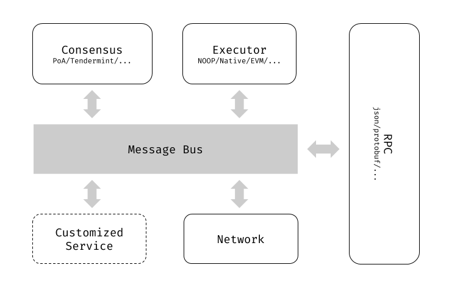
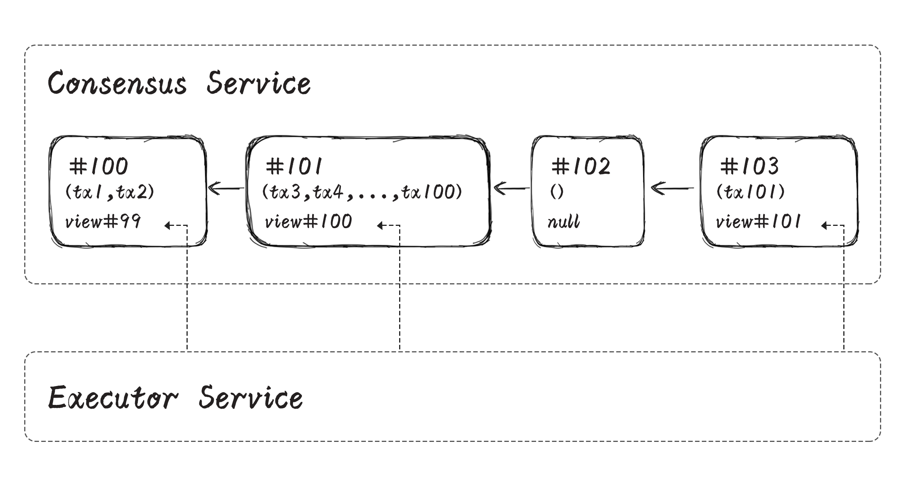

# CITA技术白皮书

Jan Xie

Version 1.0

## 概述

比特币作为区块链的起源，创造性的解决了开放网络上的分布式共识问题，为世界呈现了一种基于分布式系统及密码学的全新技术架构。后继者以太坊很好的将通用计算融合进这个架构，让人们看到了智能合约的非凡潜力。而许可链提出了一个有趣的问题：如果我们重新在节点有身份的许可网络中评估这个新架构会得到什么呢？

许可链可以很好的满足企业级应用的性能需求。身份管理以及权限控制机制是许可链的核心组件。在开放网络中节点可以自由的加入和退出，相反在许可网络中，只有获得特定许可的节点才能接入网络，与网络中的其它节点通过可验证来源的消息交互。准入机制的存在杜绝了女巫攻击，使得传统共识算法有了用武之地，使交易处理的延迟和吞吐量获得质的飞跃。

在开放网络上，节点配置及网络条件的差异极大。为了最大程度的降低使用门槛以及去中心化，公有链设计不得不参照最低标准的节点配置及部署环境进行设计，设计空间受到极大的限制。在许可网络中节点性能更好，配置更加一致，一个适当的架构应该利用这一点进一步提升系统处理能力。

对于分布式系统，可用性与一致性不可兼得。公有链由于技术与治理的高度去中心化，在紧急状况出现时缺乏高效的协调及干预手段。为绕过这个缺点，公有链在设计时以可用性为先，牺牲了在网络分区情况下的一致性保证。企业级应用中用户具有更好的协调机制，在系统不可用时的干预方法相对高效，同时对一致性又有较强要求，与公有链的设计偏好有较大的区别。

随着使用区块链应用的用户数量增加，区块链必须水平扩展以支撑越来越大的交易处理和存储需要。保持系统安全性不变的水平扩展能力是区块链的必备属性，虽然我们目前还没有看到做到这一点的公有链，但是许可链已经可以给出不同的答案。

区块链上数据对所有共识节点公开，基于假名的隐私方案并不能完全满足企业级应用的需求。另一方面，各种密码学隐私方案的安全性尚未得到完全验证，性能离实用也还有距离。我们需要一个不完美但现在就能用的隐私方案，以及一个模块化的可以轻松融合未来隐私技术的区块链架构。

企业级应用场景业务逻辑繁杂，单一的通用设计只能够满足最低需求，很难将应用潜力全部挖掘。为了最大化应用区块链技术带来的效率提升，区块链软件必须可定制，以适应各种不同的部署和集成环境。

随着区块链技术的不断普及，独立的区块链网络必然不断出现，区块链网络之间进行交互，形成区块链网络的网络。合理的区块链设计需要提供跨链的基础，才能让其上运行的应用在未来产生更大的价值。

基于这些理念，我们设计了CITA，一个面向企业级应用的支持智能合约的区块链框架。CITA可以为企业级区块链应用提供一个稳固、高效、灵活、可适应未来的运行平台。

## 微服务

水平扩展能力是企业级应用成功的关键，也恰恰是现有区块链技术最突出的问题。无论区块链网络中节点数量多少，整个网络的处理能力都只相当于单个节点的处理能力。要提升整个网络的处理能力只有两个选择：

1. 在保证安全性的前提下放弃全局交易验证，i.e. 分片或是跨链；
2. 提升单个节点的处理能力，i.e. 使用性能强劲但是价格昂贵的专用服务器（scale up）。

而CITA则是利用微服务架构来提高单（逻辑）节点处理能力。通过微服务架构（见图1），将单个节点按照不同的功能解构为一组松耦合微服务，微服务之间通过消息总线进行通讯。在CITA中，“节点”是一个逻辑概念，有可能是一台服务器（上面运行一组微服务），也有可能是一组服务器组成的集群。

基于微服务架构，CITA非常容易水平扩展，在系统负载上升时，可以通过增加服务器的方式增加节点的处理能力。对于系统中的热点账户，甚至可以使用专门的服务器提供服务。我们把这种水平扩展方式称为**内部分片（Internal Sharding）**。

CITA节点对服务器硬件要求低，交易处理可以被分散到多台普通PC服务器上，无需专门硬件支持即可应对企业级场景。在节点角色多样化的场景中，不同节点亦可运行不同的微服务组合，实现不同的角色功能。

业务优化与系统深度集成在CITA中都能轻松实现。微服务之间通过消息进行通讯，耦合程度低。只要能够解析和返回相关的消息，用户能够用任意语言实现所需的服务实现对节点某个组件的替换。外部系统也可以直接连接到消息总线上，实时获取节点运行时消息，轻松实现深度集成。

## 共识服务 Consensus

区块链节点通过共识算法形成一致的交易历史记录。通过共识服务，有效的交易被选择出来，并形成全局的全序或者半序关系，为交易处理提供基础。交易通过可证数据结构凝结成不可篡改的历史，在被执行器处理之后形成的数据我们称之为视图（View），记录用户账户余额的账本即是视图的一种。

不同的区块链设计对于视图是否需要共识有不同的态度。UTXO集合在Bitcoin区块中并无体现，相反由账户集合形成的“世界状态”的特征值会被记录在Ethereum/Fabric区块中。对视图数据进行共识，有利于发现交易处理中的问题；将视图的特征值固化在区块中，有利于节点间视图数据的交换，是轻节点验证和跨链协议的重要基础。CITA的区块数据结构设计兼顾了视图共识的需要。

作为一种多参与方的共享服务，保证使用者发出的交易能够在一定的时间内被处理是一个重要的设计目标，我们称之为反屏蔽。在企业级应用场景中，用户的交易不能及时被处理可能会给用户造成巨大损失，例如在规定时间内无法向智能合约补充保证金导致强行平仓。由于出块节点拥有交易的选择和排序权，出块节点必须以一定的规则轮换，以保证单一节点无法长时间将某些特定的交易排除在外。CITA使用出块节点主动轮换策略以满足反屏蔽的要求。默认的顺序轮换能够满足一般应用的需要，同时也提供随机轮换作为扩展模块。

在产生新区块后，CITA默认使用Tendermint算法进行共识。Tendermint是一种专为区块链设计的高性能共识算法，基于半同步网络假设，Tendermint能够容忍1/3的拜占庭节点。CITA共识节点通过点对点共识消息交换协议对每一个区块交换投票信息，迅速形成多数共识。投票结果最后会被记录在区块里。CITA支持独有的低延迟技术，能够实现毫秒级交易确认延迟，满足各种应用的需要。

Tendermint可以方便的被替换成任何更合适的共识算法，只要实现共识服务标准接口，替换算法可以用任意语言实现。需要注意的是，共识算法替换往往涉及网络、存储等多个方面，很难被完美抽象，因此共识算法的替换可能不仅仅需要共识服务的替换，还需要同步对其他微服务进行定制。

## 交易处理服务

### 异步交易处理（ATE）

区块链节点的最主要职责包括点对点网络交互、共识、交易处理以及数据存储四个方面。节点通过共识算法，在系统中形成对交易排序的全局共识，再按照共识后的顺序对交易进行逐个处理。只要处理过程能保证确定性，所有节点最后都能达到一致的状态，产生相同的本地数据。

在当前的区块链设计中，共识与交易处理耦合程度较高，共识的性能受到交易处理能力的影响。CITA将共识与交易处理解耦为独立的微服务，共识服务只负责交易排序，并不关心交易内容，交易处理服务只负责对排好顺序的交易进行处理。此时共识过程可以先于交易处理完成，交易处理服务可以异步执行。异步交易处理技术不仅使CITA具有更好的共识性能，还带来了更有弹性的交易处理能力，交易负荷可以被更均匀的分摊到一段时间内（见图2）。

由于交易异步处理，在共识前只能对交易进行有限的检查，例如签名验证。无效的交易有可能通过共识进入交易处理服务，产生一定程度的垃圾数据。在有必要的情况下，可以通过CITA的交易配额机制及垃圾清理技术解决该问题。

### 执行器 Executor

相对于交易列表，应用更关心的数据是视图。执行器以排好序的交易为输入，在处理过程中相应的更新对应的视图。即使处理的是相同的交易列表，不同的执行器可以产生不同的视图。CITA默认支持如下执行器：

1. NOOP: 最简单的执行器，对传入的交易不做任何处理。
2. Native: 原生执行，将交易通过标准接口交给原生代码执行。
3. EVM: 对以太坊虚拟机的封装，可以处理以太坊轻量智能合约的部署和调用。
4. Private: 隐私交易处理，详见隐私交易。
5. Hybrid: 混合执行器，能够组合执行器形成新的执行器。

视图状态则是执行器执行过程中读写的对象，不同的视图状态模型使用不同的基本数据单元，常见的有UTXO及账户两种。在UTXO模型中，由UTXO构成账本视图，每个交易在销毁旧UTXO的同时创造新的UTXO；在账户模型中，由账户构成世界状态视图，交易在处理过程中可以读写多个账户。

UTXO模型包含交易前后记账单位数量不变约束，引入了业务逻辑，放弃了一定的通用性;将账户状态离散保存在多个UTXO中，获得了有限的并行能力提升，也带来了分割/合并UTXO的复杂度。账户模型相对更加简单，实现通用任务更有效率。在企业级应用中往往存在身份验证与授权的需要，这些服务所依赖的数据可以自然的与账户关联。CITA默认支持账户模型。用户可以自定义包括UTXO在内的其他状态模型。

### 配额 Quota

交易会被复制到多个节点进行执行和存储。节点的计算资源（包括CPU、磁盘空间、带宽等）有限，为所有用户共享，如果某个用户无意或是有意提交了过重的执行任务会导致节点负荷过重失去响应。因此支持智能合约的区块链需要恰当的机制来限制资源使用。在CITA中我们将资源的度量称为计算配额，相应的发行和消耗机制称为配额管理。配额消耗和发行策略都可以由具有权限的用户制定。

不同的执行器具有不同的配额消耗机制。例如，NOOP执行器按照交易数据大小计算配额消耗，Native执行器随着真实世界的时钟跳动计算消耗，而EVM自带细粒度的GAS计算机制，按照指令复杂度计算配额消耗。在CITA中我们可以为区块(中的视图）或是用户设置配额消耗上限，以此将控制单个区块的资源消耗。

与公有链不同，许可链中往往无需发行代币以提供链上的共识激励，因此我们需要一种替代机制发放计算配额以补充用户的配额消耗。CITA中的配额发行策略非常灵活，不仅默认支持包括周期性恢复在内的简单策略，也可以根据需要自定义复杂策略。

### 视图 View

区块链是一种联机交易处理系统（OLTP），用户广播交易，节点收到交易以此作为输入进行处理。区块链交易处理有多种各有利弊的方案，但目前的区块链系统大多使用单一固定方案，难以满足不同场景的不同需求。通过交易通道技术，CITA实现了多执行策略支持与基本的并行处理。

用户在配置CITA区块链网络时可以设定多个视图，视图相互独立。每个视图都可以设定对应的交易执行器和状态存储模型，并将交易执行器注册到交易路由。交易在经过共识服务排序后，由交易路由分配到不同的执行器处理（见图3）。不同视图处理的交易子集可以有交集，也可以没有交集。

通过灵活的视图配置，CITA可以全面的支持各种应用场景。例如配置NOOP执行器的视图能够很好的支持数据存证的场景，避免不必要的执行开销；Native执行器与账户模型的组合适合业务逻辑比较固定的场景，同时能够获得很好的性能；EVM执行器与账户模型组合适用于业务逻辑灵活多变的场景。

由于使用独立的状态存储，CITA支持对不同的视图使用独立的交易处理服务并行处理。在配置了多个视图的CITA区块链网络中，系统处理能力几乎可以与视图数量成正比。

### 隐私交易

智能合约执行与隐私保护有本质的矛盾。执行和验证智能合约要求所有共识节点能够读取交易中的数据，而隐私保护要求无关共识节点不能看到交易中的数据。

基于假名（pseudonymous）的隐私保护，只能在一定程度上隐藏交易的发起方和接收方, 通过数据分析手段还是能获得交易方信息。在使用临时私钥对交易加密的方案中，共识节点依然需要对交易进行解密才能执行交易，交易对共识节点没有隐私。在许多应用场景中，共识节点相互之间可能存在竞争关系，无法采用这样的方案。

最新的密码学技术，例如零知识证明以及同态加密，可以帮助我们做到在不知道交易数据的情况下执行交易。但是这些技术并不成熟，性能难以实用，安全性有待时间检验。

CITA 1.0通过交易局部执行技术，实现了一种实用的隐私方案。隐私交易提交后，先在本地进行加密，加密后的交易通过点对点隐私交易传输协议被传送给拥有解密私钥的节点，同时交易哈希被打包进入区块链。隐私交易数据只在拥有解密私钥的相关节点上保存，相关节点先解密再执行交易，交易数据不会发送给无关节点，完全杜绝了任何信息泄漏的可能。

## 身份验证与授权服务

区块链中的参与方可分为节点和用户两类。节点是区块链服务的提供者，用户是区块链服务的消费者。

CITA为节点身份验证提供了标准接口，同时对节点接入进行更严格的控制。对于身份验证失败的节点，即使该节点能够在网络层与其他CITA节点联通，CITA节点也会拒绝与其建立通讯会话，避免信息泄漏。

在企业应用环境中，可能已经存在中心化用户身份验证服务，例如LDAP或是PKI证书体系。CITA为用户身份验证提供了标准接口，能够方便的与企业内已有的身份验证服务集成。

在基于非对称加密的身份验证方案中，用户私钥丢失是一个难以处理的问题。CITA的身份验证服务支持更复杂的身份管理策略，在用户私钥丢失或是定期更新时，具有私钥更新权限的操作者可以根据用户申请使用新的私钥替换旧的私钥。

CITA实现了基于角色的权限控制（Role-based access control）以满足企业级应用的需要。CITA为可供用户操作的资源进行了细粒度的划分和权限定义，并允许用户自定义角色，用户可以通过角色方便的组织用户、管理资源权限，使权限分配准确匹配企业的组织架构。同时权限与角色数据和变更历史都会被保存在区块链上，满足日后审计需要。

## 系统治理

区块链是反映**人类共识**的工具。在正常情况下，区块链可以促成自动化协作，在非正常情况下可能产生错误的视图数据，此时可以根据无法篡改的交易历史作出修正决策。作为一种由对等节点构成的分布式系统，区块链在技术架构上不存在中心点，在治理层面则存在无中心，多中心甚至单中心多种可能。CITA以**交易历史不可修改**为设计原则，支持各种治理机构以及视图订正。

在CITA中用户可以设定超级管理员角色，得益于灵活的身份验证服务设计，超级管理员角色可以有任意的身份验证逻辑。在单中心的治理结构下该角色可以由单一核心用户控制，在多中心的治理结构下，核心用户可以形成类似委员会的治理机构联合控制（例如通过多重签名）超级管理员角色。

中心化治理角色能够通过链外通道协商形成一致行动决议，增强系统在紧急情况下的应对能力。在操作错误、软件错误或是硬件错误等问题发生时，系统可能进入紧急状态。我们可以将紧急状态分为交易可恢复（Transaction Recoverable）和消息可修复（Message Recoverable）两类。

由于错误的交易或者是有bug的智能合约生成了错误的视图数据，但是节点依然能够处理交易，此时系统处于交易可恢复紧急状态。在这种情况下，超级管理员可以构造修订交易快速应对。节点在处理修订交易时同样会先将该交易打包入块，再执行交易，因此所有修订交易都将被记录在历史中，为操作审计提供支持。

消息可修复紧急状态发生时，节点无法再正常处理交易并打包，共识服务停滞，但是点对点网络依然能够正常工作。此时超级管理员可以通过CITA提供的管理员工具构造特殊消息并广播，节点收到消息并验证发送者身份后将直接处理，无需共识。

## 总结

为了满足企业级应用的需要，我们提出了一个支持智能合约的区块链框架CITA。CITA将区块链节点的必要功能解耦为微服务，共识、交易处理、点对点网络协议、身份验证与授权等组件之间通过消息总线交换信息相互协作，为应用提供服务。CITA的设计充分考虑了通用性与未来扩展的可能，通过配置和定制相应的服务，CITA能够满足企业级用户的全部需要。
